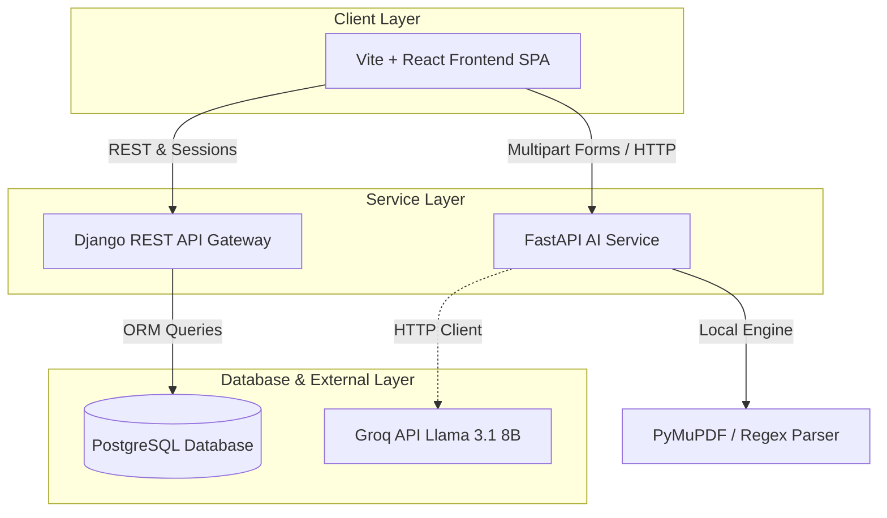
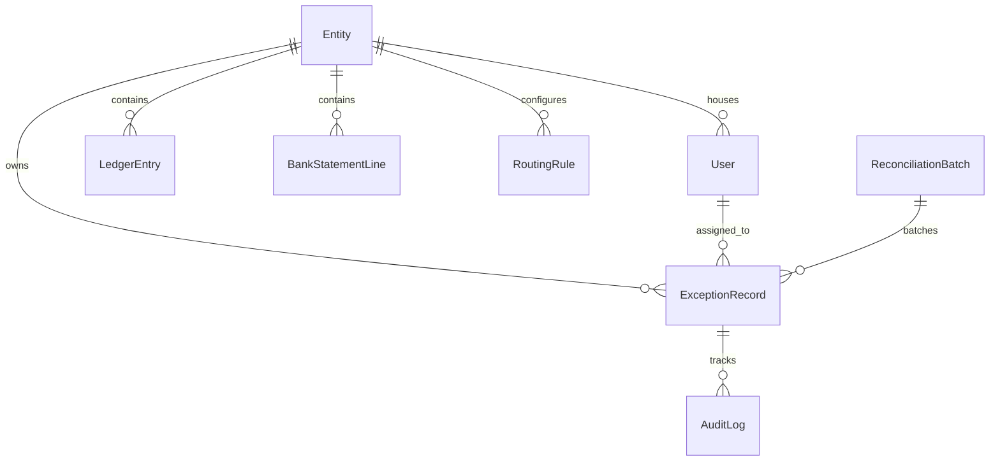
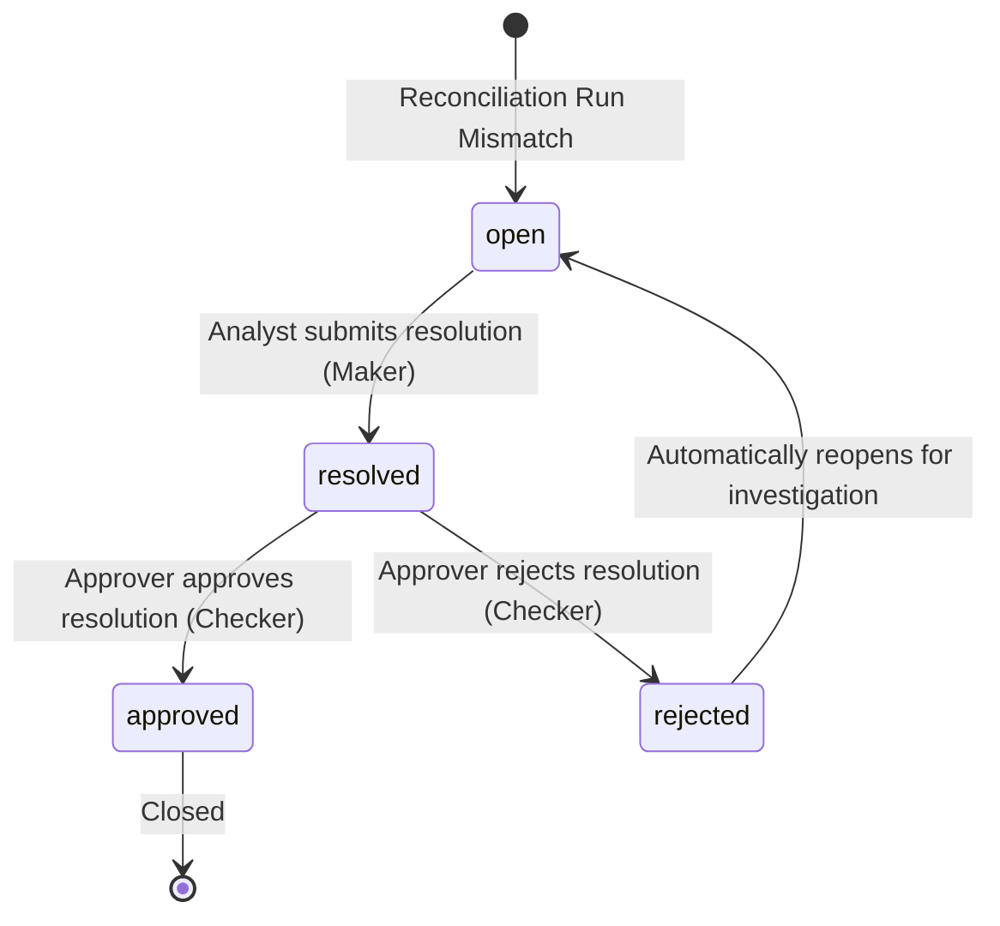
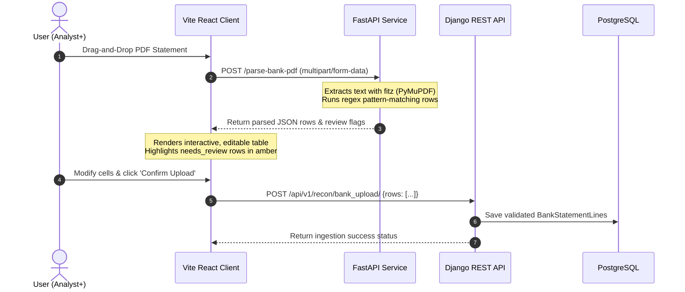

# ExceptionIQ — Enterprise Reconciliation Exception Orchestration Platform

ExceptionIQ is a purpose-built B2B SaaS platform designed to orchestrate the lifecycle of reconciliation exceptions from detection to closure. This platform leverages a microservices-based architecture to ingest bank statements, match transactions against a general ledger, detect exceptions, route them to appropriate analysts, and enforce a secure maker-checker approval workflow.

---

## 🏗️ System Design & Architecture

ExceptionIQ uses a decoupled microservices architecture designed for scalability, security, and separation of concerns.



### Component Breakdown

1. **Vite React Frontend**:
   - Served on port `5173`.
   - Single Page Application (SPA) built with React, TypeScript, and Vanilla CSS.
   - Leverages React Context for Authentication (`AuthContext.tsx`).
   - Implements role-specific dashboards, dynamic navigation filtering, an interactive bank statement spreadsheet preview, and action boards based on current user roles.
2. **Django API Gateway & Backend**:
   - Served on port `8000`.
   - Houses the core business logic, Django ORM database schemas, automated transaction-matching reconciliation algorithms, and audit logging.
   - Enforces Role-Based Access Control (RBAC) via custom REST framework permissions (`RolePermission`).
   - Manages state machine transitions for exception lifecycles.
3. **FastAPI AI Service**:
   - Served on port `8001`.
   - Responsible for computationally heavy operations: PDF extraction and natural language processing.
   - Uses **PyMuPDF (`fitz`)** for extracting layout-aware text from PDF bank statements and regex pattern matches to parse transaction records.
   - Integrates with the **Groq SDK** to fetch advanced LLM-based insights and falls back to a smart, rule-based local summary generator if no API credentials exist.
4. **PostgreSQL Database**:
   - Mapped on port `5432`.
   - Relational database storing tenant entities, ledger entries, bank statement rows, reconciliation batches, exception records, audit trails, and routing rules.

---

## 🗄️ Relational Data Models & Schema

The PostgreSQL database houses the following structural tables managed via Django's ORM:



* **Entity**: Represents a corporate entity or tenant (e.g., HDFC Bank, Axis Bank).
* **User**: Represents team members across different roles (`analyst`, `approver`, `manager`, `admin`, `viewer`).
* **LedgerEntry**: Records from the company's internal ERP or General Ledger (GL) system.
* **BankStatementLine**: Uploaded transaction rows from external bank statement documents.
* **ReconciliationBatch**: Grouping table representing individual runs of the reconciliation engine.
* **ExceptionRecord**: Generated logs for transactions showing discrepancies (e.g., amount mismatch, missing ledger counterpart).
* **AuditLog**: Chronological history tracking who performed what action on an exception, including humanized descriptions.
* **RoutingRule**: Logical conditions that automatically assign exceptions to specific analysts based on type or value.

---

## 🔒 Role-Based Access Control (RBAC)

ExceptionIQ enforces a strict maker-checker approval security model. Permitted actions are mapped dynamically in the backend's permissions layer and reflected in the frontend UI.

### Authorization Matrix

| Action | Viewer | Analyst | Approver | Manager | Admin |
| :--- | :---: | :---: | :---: | :---: | :---: |
| **List / View Exceptions** | ✔ | ✔ | ✔ | ✔ | ✔ |
| **Comment on Exceptions** | ❌ | ✔ | ✔ | ✔ | ✔ |
| **Resolve Exceptions (Maker)** | ❌ | ✔ | ❌ | ✔ | ✔ |
| **Approve / Reject Resolutions (Checker)** | ❌ | ❌ | ✔ | ✔ | ✔ |
| **Reassign Exceptions** | ❌ | ❌ | ❌ | ✔ | ✔ |
| **Ingest Bank Statements** | ❌ | ✔ | ❌ | ✔ | ✔ |
| **Reconciliation Matching Runs** | ❌ | ✔ | ❌ | ✔ | ✔ |
| **CRUD Routing Rules** | ❌ | ❌ | ❌ | ❌ | ✔ |
| **CRUD Entities** | ❌ | ❌ | ❌ | ❌ | ✔ |
| **Clear DB / Developer Tools** | ❌ | ❌ | ❌ | ❌ | ✔ *(Debug only)* |

---

## 🔄 Core Flow Lifecycles

### 1. The Exception Life Cycle
An exception's journey is governed by a state machine that requires separate users for the resolution (Maker) and approval (Checker) steps:



### 2. PDF Bank Statement Ingestion Pipeline
Ingesting a physical statement involves coordinated tasks between the frontend, FastAPI, and Django:



---

## 🔌 Port Mapping & Configurations

| Service | Host Port | Internal Container Port | Description |
| :--- | :---: | :---: | :--- |
| **React SPA** | `5173` | `5173` | The web frontend interface. |
| **Django API Gateway** | `8000` | `8000` | The backend API server. |
| **FastAPI Service** | `8001` | `8001` | The AI engine and document parser. |
| **Postgres Database** | `5432` | `5432` | Storage engine. |

### Environment Variables (`.env`)

Copy `.env.example` into `.env` at the root folder:
```bash
# Groq LLM API Key (optional - fallback local matching works if blank)
GROQ_API_KEY=your-groq-api-key

# Developer Switcher Options
VITE_DEV_TOOLS=true
```

---

## 🚀 Getting Started

### Prerequisites
* Docker and Docker Compose installed.
* Python 3.10+ (if running tests or server components on host).

### Setup and Running with Docker Compose

Build, configure, and start the entire suite with one command:
```bash
docker compose up --build -d
```
This automatically:
1. Provisions the PostgreSQL container and initializes the schema via Django database migrations.
2. Seeds default corporate entities, user accounts (`analyst`, `approver`, `manager`, `admin`), routing rules, and **30 detailed pre-populated exceptions** across all statuses using the custom `seed_db` command.
3. Launches the dev servers for Frontend, Backend, and AI Service containers.

---

## 🧪 Testing Suite (pytest)

The project includes a comprehensive verification suite featuring **89 backend tests** and **23 AI service tests** (112 tests total).

### Running Tests in Docker Containers (Recommended)

Since PyMuPDF requires binary wheel configurations that can vary across host environments, it is recommended to run tests directly inside the active Docker containers:

* **Run Backend Test Suite (Django)**:
  ```bash
  docker compose exec backend python -m pytest tests/ -v
  ```
* **Run AI Service Test Suite (FastAPI)**:
  ```bash
  docker compose exec ai_service python -m pytest tests/ -v
  ```

### Running Tests Locally (Host Environment)

If running outside Docker:
1. Ensure the relevant virtual environments are initialized and active.
2. Install test dependencies:
   ```bash
   # Backend
   cd backend
   pip install -r requirements.txt -r requirements-test.txt
   python -m pytest tests/ -v

   # AI Service
   cd ../ai_service
   pip install -r requirements.txt -r requirements-test.txt
   python -m pytest tests/ -v
   ```
